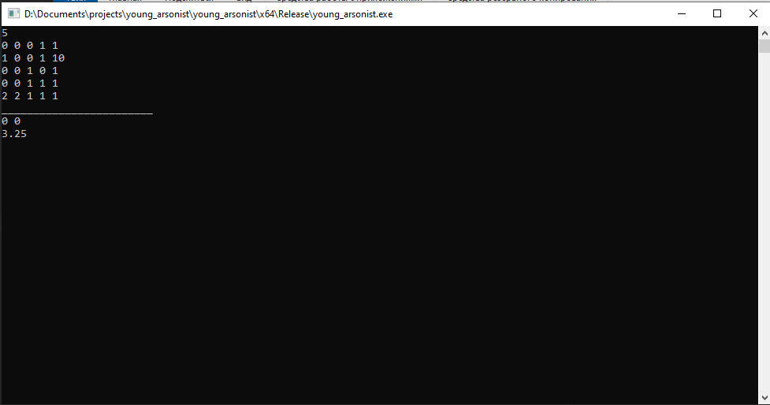

# young arsonist 
# Юный поджигатель
Имя входного файла: f.in.
Имя выходного файла: f.out

На клеточном поле введена система координат так, что центр координат находится в точке пересечения линий сетки, а оси направлены вдоль линий сетки.На этом поле выложили связную фигуру, состоящую из спичек. Использовались спички двух типов:•	Спички длины 1 выкладывались по сторонам клеток.•	Спички длины корень из 2  выкладывались по диагоналям клеток.Ребенок хочет сжечь фигуру. При этом он может поджечь ее в одной точке, имеющей целочисленные координаты (например, в точке A на рисунке поджигать фигуру нельзя, а в точках B и C — можно).Известно, что огонь распространяется вдоль спички равномерно (но по каждой спичке — со своей скоростью). Спичка может гореть в нескольких местах (например, когда она заго-рается с двух концов; или когда в середине диагональной спички огонь перекидывается с од-ной спички на другую — огонь распространяется по вновь подожженной спичке в обе сторо-ны).Напишите программу, которая определит, в какой точке нужно поджечь фигуру, чтобы она сгорела за минимальное время.
## Пример
f.in  
5  
0 0 0 1 1  
1 0 0 1 10  
0 0 1 0 1  
0 0 1 1 1  
2 2 1 1 1  

f.out  
0 0  
3.25  

## Работа программы
Для нахождения кратчайших путей между всеми парами вершин используется алгоритм Флойда-Уоршелла.  

